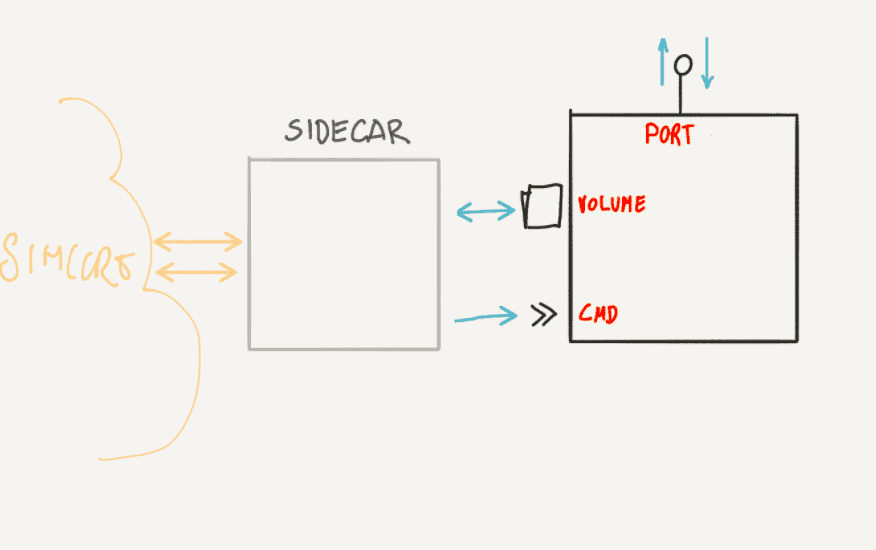

 ### Control Core

 

 
 ### Example: *control* loop with two nodes
 
 created two interacting nodes (I renamed them "*control*" and "*PM*")

 They each do a silly computation:

 1. *control* increments the output of *PM* (``y``) by one and this result (``x``) is the input to *PM* 
 2. *PM* increments its input (``x``) by ``0.5`` and this result is the input to *control*.
 3. To keep it from being an infinite loop, they both terminate when ``x>10``, and reset their values back to ``0`` (so I can rerun the notebook easily).

When I first start one node, it is just stuck at ``0``, but when I start the other node, they progress such that ``x`` is always one larger than ``y``

### in osparc

Currently this is how it looks and works

### Interfaces to container

